<div align="center">
<h1>Depanini</h1>
</div>

<div align="center">
   
</div>

## 📱 Screenshots

<table style={border:"none"}>
  <tr>
    <th colspan="4" style="text-align:center;">Authentication Screens</th>
  </tr>
   <tr>
      <td></td>
      <td>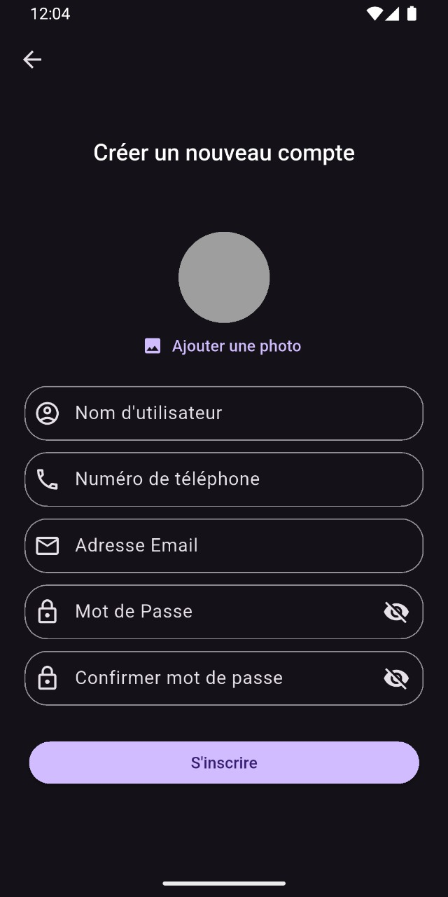</td>
      <td>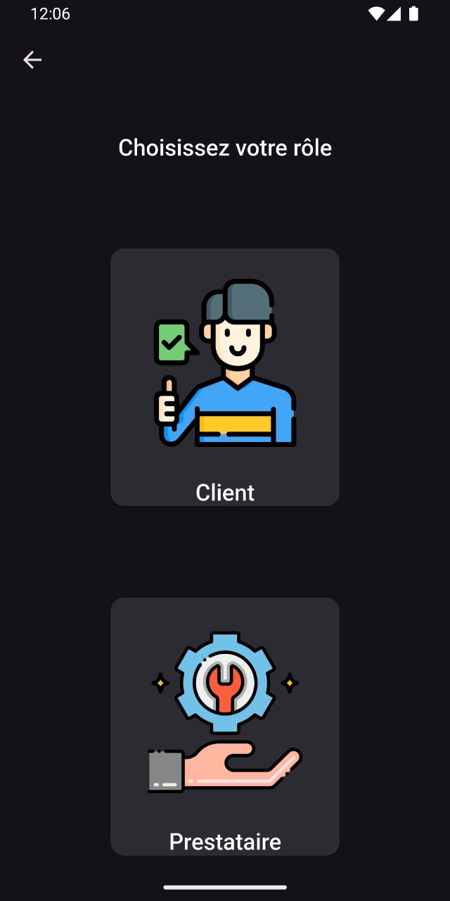</td>
      <td>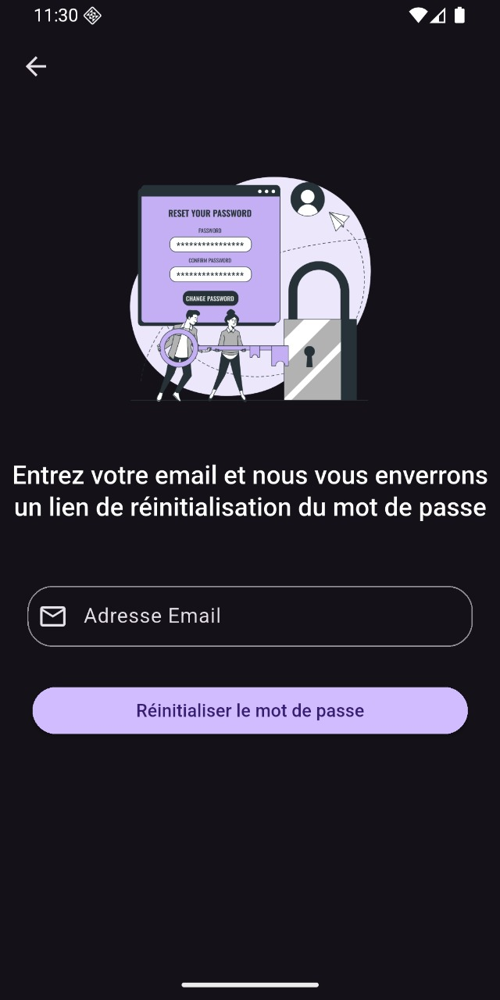</td>
   </tr>
  <tr>
    <th colspan="7" style="text-align:center;">Client Screens</th>
  </tr>
   <tr>
      <td>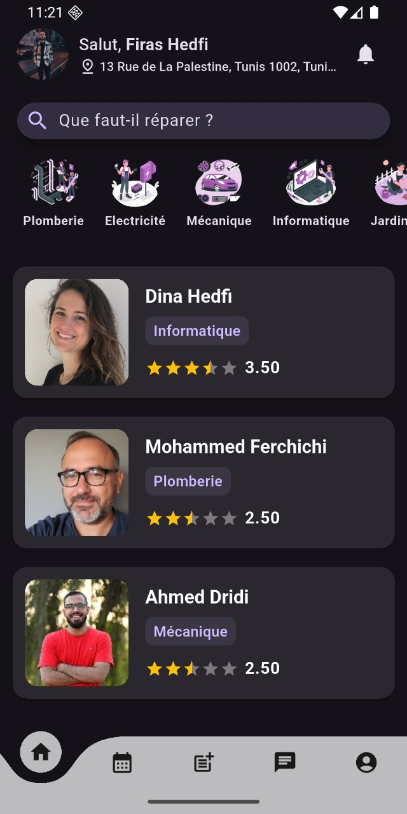</td>
      <td>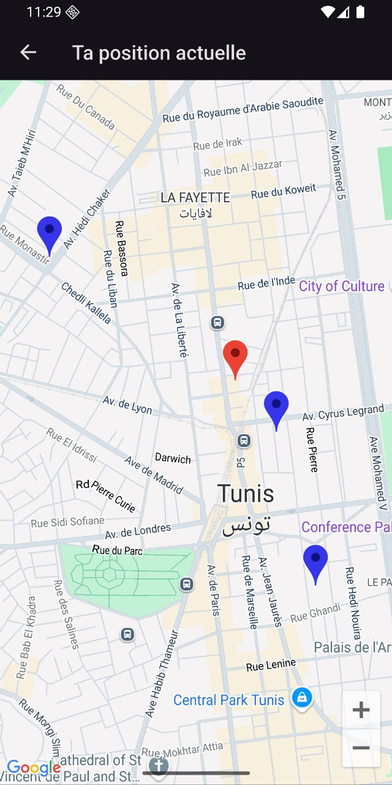</td>
      <td>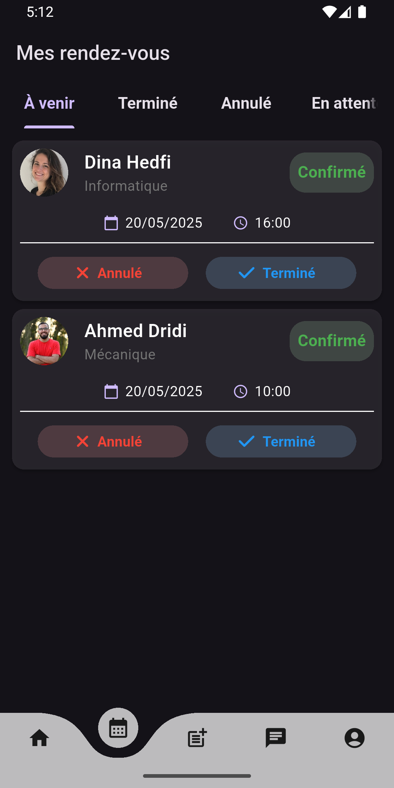</td>
      <td>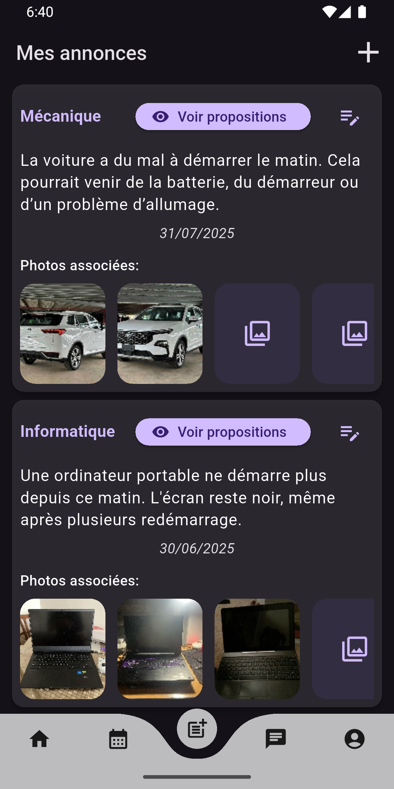</td>
      <td>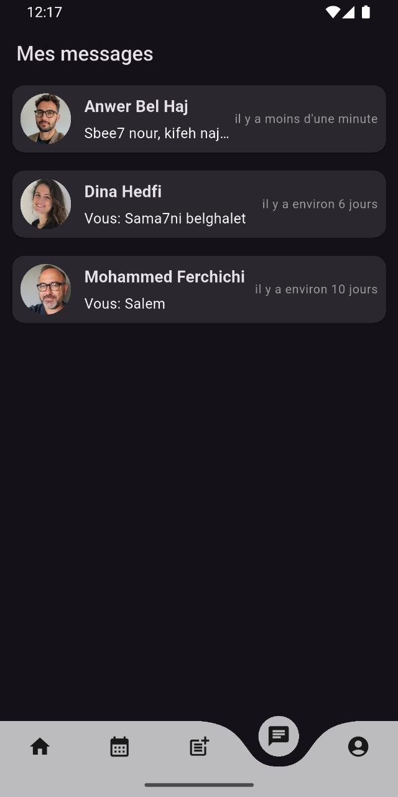</td>
      <td></td>
      <td>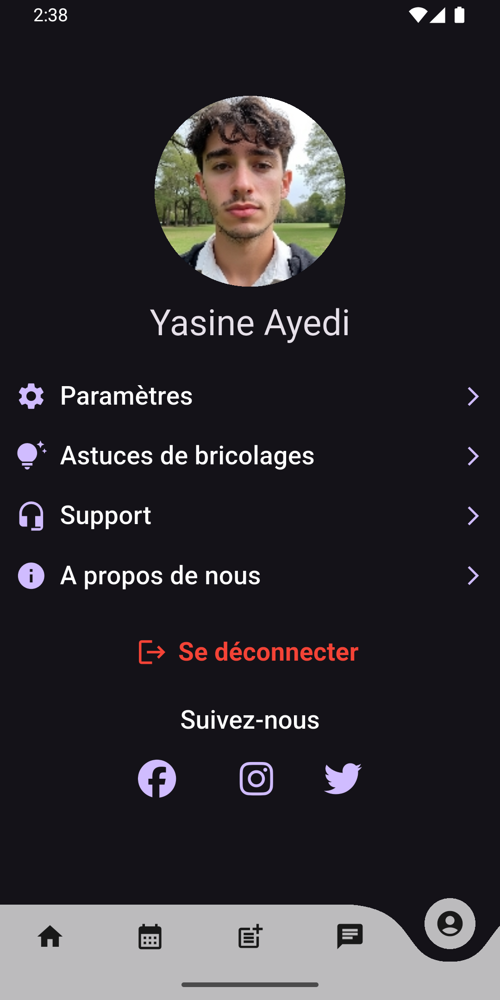</td>
   </tr>
  <tr>
    <th colspan="3" style="text-align:center;">Provider Screens</th>
  </tr>
   <tr>
      <td>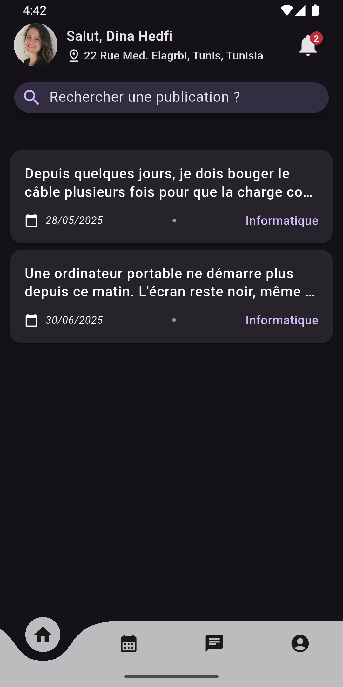</td>
      <td>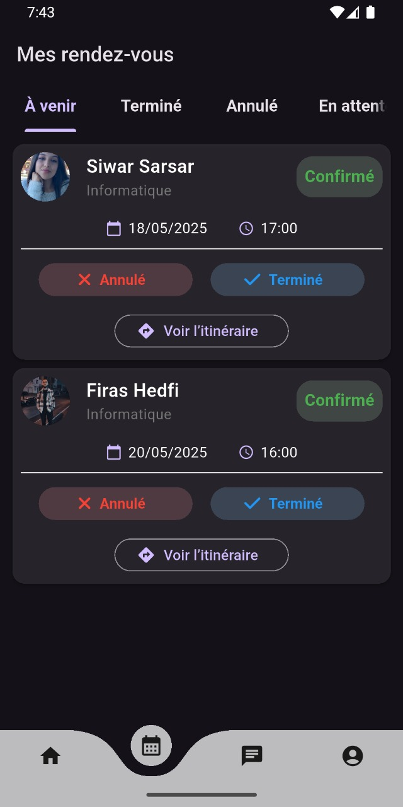</td>
      <td>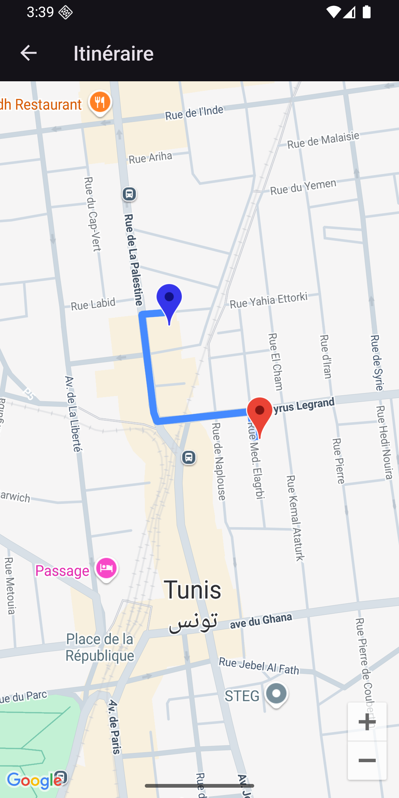</td>
   </tr>
  <tr>
    <th colspan="2" style="text-align:center;">Admin Screens</th>
  </tr>
   <tr>
      <td>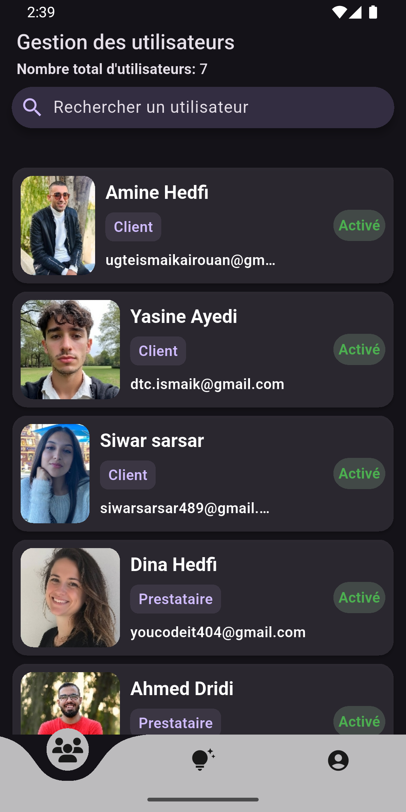</td>
      <td>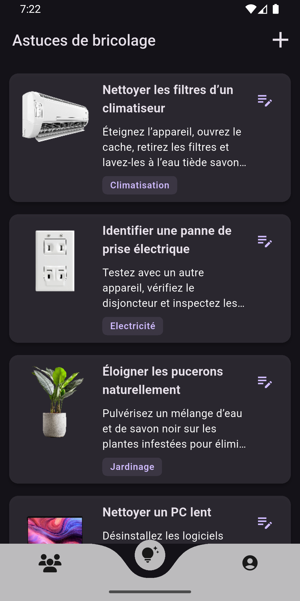</td>
   </tr>
</table>

## ✨ Features

- **Authentication**: Secure signup/login with role-based access
- **Service Discovery**: Search and book services by location/category
- **Real-time Communication**: Chat system with push notifications
- **Interactive Maps**: View provider locations and routes to clients
- **Community Content**: DIY tips and service announcements
- **Safety Features**: Reporting system and content moderation
- **Admin Dashboard**: Complete system management

## 🚀 Getting Started

### Prerequisites

Before running this project, make sure you have the following installed:

- [Flutter](https://flutter.dev/docs/get-started/install) (version 3.0.0 or higher)
- [Dart](https://dart.dev/get-dart) (version 3.0.0 or higher)
- [Android Studio](https://developer.android.com/studio) or [VS Code](https://code.visualstudio.com/)
- [Xcode](https://developer.apple.com/xcode/) (for iOS development, macOS only)

### Installation

1. **Clone the repository**
   ```bash
   git clone https://github.com/firashedfi5/Depanini.git
   cd Depanini
   ```

2. **Install dependencies**
   ```bash
   flutter pub get
   ```

3. **Run the app**
   ```bash
   flutter run
   ```

### Platform-specific Setup

#### Android
- Minimum SDK version: 21
- Target SDK version: 34
- Make sure you have an Android device connected or an emulator running

#### iOS
- Minimum iOS version: 11.0
- Xcode 12.0 or higher
- Valid Apple Developer account (for device testing)

## 🏗️ Project Structure
```
lib/
├── main.dart                          # 🚀 App entry point and initialization
├── constants/                         # 📋 App-wide constants and configuration    
├── data/                              # 💾 Data layer
├── models/                            # 🏗️ Domain models
├── providers                          # 🔄 State management
├── screens                            # 📱 UI screens
├── theme                              # 🎨 App theming and styling
├── widgets                            # 🧩 Reusable UI components
```

## 🔧 Configuration

### Environment Variables

Create a `.env` file in the root directory:

```env
API_KEY=your-api-key
```

### Firebase Setup

1. Add your `google-services.json` (Android) to `android/app/`
2. Add your `GoogleService-Info.plist` (iOS) to `ios/Runner/`
3. Initialize Firebase in `main.dart`

## 🚀 Building for Production

### Android (APK)

```bash
flutter build apk --release
```

### Android (App Bundle)

```bash
flutter build appbundle --release
```

### iOS

```bash
flutter build ios --release
```

## 🤝 Contributing

1. Fork the project
2. Create your feature branch (`git checkout -b feature/AmazingFeature`)
3. Commit your changes (`git commit -m 'Add some AmazingFeature'`)
4. Push to the branch (`git push origin feature/AmazingFeature`)
5. Open a Pull Request

## 📄 License

This project is licensed under the MIT License - see the [LICENSE](LICENSE.md) file for details.

## 📞 Support

If you have any questions or need help, please:

1. Check the [Issues](https://github.com/firashedfi5/Depanini/issues) page
2. Create a new issue if your problem isn't already reported
3. Contact me at: firashedfi4@gmail.com

## 🔄 Changelog

### Version 1.0.0
- Initial release
- Basic functionality implemented
- Cross-platform support

---

**Happy coding! 🎉**
